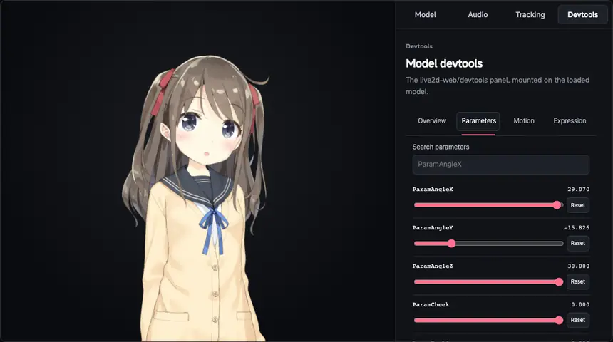

<p align="center">
  
</p>

<p align="center">
  JavaScript와 React를 위한 비공식 Live2D Cubism 런타임입니다.<br>
  PixiJS 없이 WebGL2로 직접 렌더링합니다.
</p>

<p align="center">
  <strong><a href="https://live2d-web.heonys.dev/docs/ko">한국어 문서</a></strong> ·
  <a href="https://live2d-web.heonys.dev/ko/playground">Playground</a> ·
  <a href="https://live2d-web.heonys.dev/ko/inspect">모델 검사기</a> ·
  <a href="examples">예제</a> ·
  <a href="https://live2d-web.heonys.dev/docs/ko/pixi-live2d-display">pixi에서 옮겨오기</a>
</p>

<p align="center">
  <a href="README.md">English</a> · <strong>한국어</strong> · <a href="README.ja.md">日本語</a>
</p>

## 주요 기능

- Framework 5-r.5 어댑터로 Cubism 3/4/5 모델을 불러와 WebGL2로 직접 렌더링
- 바닐라 JavaScript 런타임과 React 컴포넌트, 훅
- 모션, 시퀀스, 페이드, 가중 Idle, 표정, 포인터 상호작용
- 캔버스 하나에 모델 여럿, WebGL 컨텍스트를 공유
- 볼륨과 wLipSync 립싱크, MediaPipe 얼굴 트래킹(experimental)
- devtools 패널, 그리고 모델 리포트와 배치 오버레이(둘 다 experimental)

## 빠른 시작

```sh
pnpm add live2d-web
```

Cubism Core와 모델은 패키지에 포함되지 않습니다. Live2D 약관에 따라 Core를
받아 직접 호스팅하고, 사용 권한이 있는 Cubism 3/4/5 모델 디렉터리를 제공하세요.

```ts
import { createLive2D } from 'live2d-web'

const character = await createLive2D({
  container: document.querySelector('#avatar')!,
  coreUrl: '/live2dcubismcore.min.js',
  src: '/models/model.model3.json',
  followPointer: true,
})

await character.motion('TapBody', 0)
character.dispose()
```

```tsx
import { Live2DCanvas, Live2DModel } from 'live2d-web/react'

export function Avatar() {
  return (
    <Live2DCanvas coreUrl="/live2dcubismcore.min.js">
      <Live2DModel src="/models/model.model3.json" followPointer />
    </Live2DCanvas>
  )
}
```

호스트 요소에는 CSS 크기가 필요합니다. JavaScript 인스턴스는 화면에서 제거할 때
dispose하고, React 컴포넌트는 unmount 시 스스로 정리합니다.

`pixi-live2d-display`를 쓰고 있다면
[pixi-live2d-display에서 옮겨오기](https://live2d-web.heonys.dev/docs/ko/pixi-live2d-display)를
보세요. 함수 대응표와 함께, Pixi에 남는 편이 나은 경우도 적어뒀습니다.

## Live2D Devtools

`live2d-web/devtools`는 불러온 모델에 패널을 붙여, 그 모델이 실제로 선언한 것을
보여줍니다. 파라미터, 모션 그룹, 표정, 히트 영역입니다. 파라미터를 끌면 모델이
바로 반응하므로, 남이 내보낸 모델을 짐작으로 다루지 않아도 됩니다.

<p align="center">
  
</p>

## 자세한 문서와 예제

[한국어 문서 사이트](https://live2d-web.heonys.dev/docs/ko)는 Core·모델
준비, JavaScript, React, 모션·표정, 립싱크, MediaPipe main/Worker, Next SSR,
모바일, 오류 해결, 보안·라이선스를 다룹니다. API 시그니처는 공개 TypeScript
소스에서 생성한 [공통 레퍼런스](https://live2d-web.heonys.dev/docs/ko/api)를
사용합니다.

저장소의 Vite JavaScript·Next React·Vue Vite·투명 OBS overlay 예제는 CI에서
production build됩니다.

```sh
pnpm examples:build
```

## 호환성과 패키지 경계

기본 검증 범위는 WebGL2를 지원하는 현재 Chromium·Firefox·WebKit, Cubism Core
5.3, Framework 5-r.5입니다. 자세한 지원·미검증 상태는
[호환성 표](docs/compatibility.md)를 확인하세요.

루트 entry에는 React·Framework·MediaPipe가 들어가지 않습니다. React,
MediaPipe main/Worker, inspect, devtools, Cubism backend는 별도 경계로 유지합니다. WASM,
추적 모델, Cubism Core와 Live2D 모델은 npm 패키지에 포함하지 않습니다.

## 라이선스와 기여

live2d-web은 Live2D Inc.와 무관한 비공식 라이브러리입니다. 배포 전에
[LICENSES.md](packages/live2d-web/LICENSES.md), [라이선스 문서](docs/licensing.md), Live2D의
[SDK 라이선스](https://www.live2d.com/en/sdk/license/)를 확인하세요.

기여 방법은 [CONTRIBUTING.md](CONTRIBUTING.md)에 있습니다. Cubism Core,
라이선스 모델, 카메라 frame 또는 제한된 테스트 artifact를 GitHub에 첨부하지
마세요.
